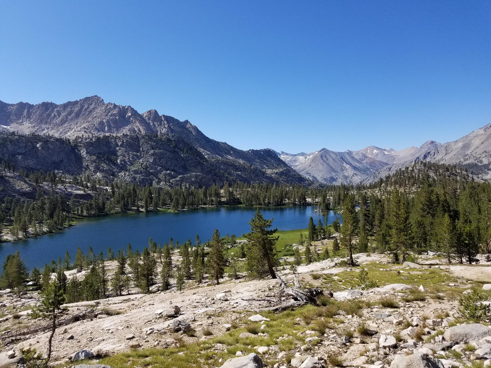
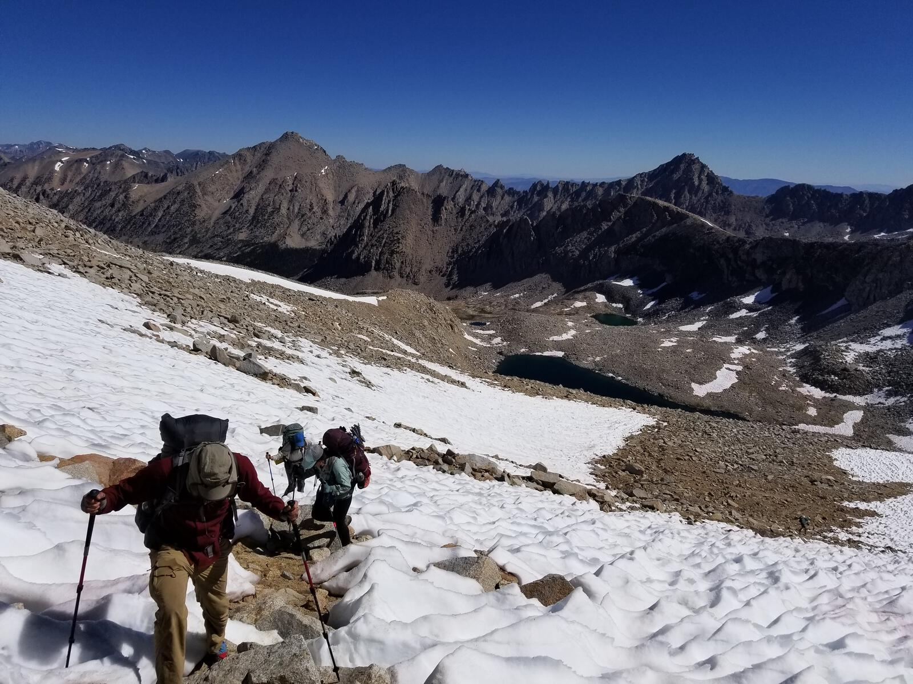
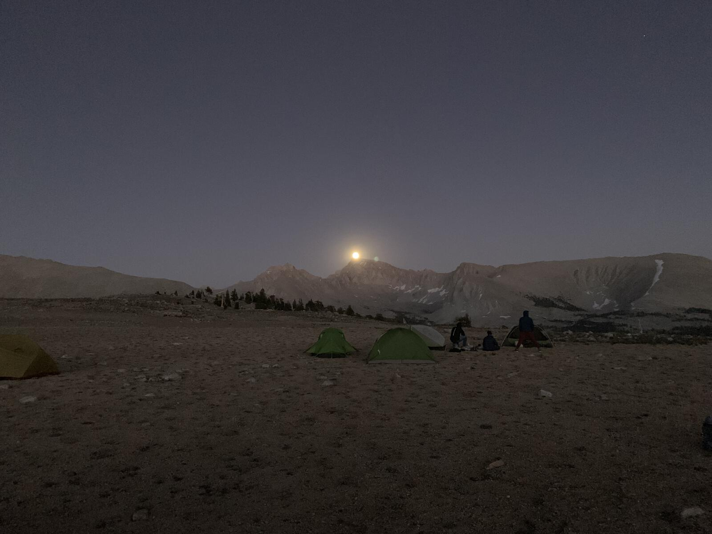
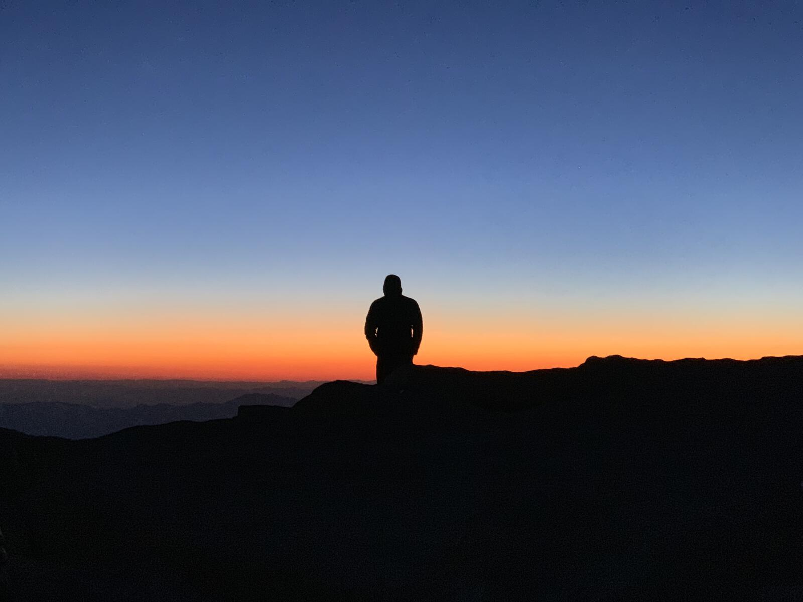

In August 2019 I was fortunate enough to traipse around the wilderness for 2 weeks hiking a 123 mile portion of the [John Muir Trail](https://en.wikipedia.org/wiki/John_Muir_Trail). It was an amazing experience. I will have more follow up posts talking about my gear, our itinerary, etc... but for now, enjoy some photos from my trip and an overview of my favorite spots.

I had only been to Yosemite once before (for a grueling one night backpacking trip up the [Snow Creek Trail to Yosemite Falls](https://www.alltrails.com/trail/us/california/upper-yosemite-falls-north-dome-indian-rock-snow-creek)) so just driving up to Vermillion Valley Resort (VVR) and VVR itself were absolutely stunning.

After our first day of hiking we stayed just below Seldon Pass at Marie Lake.

I completed this trip with my brother [Tim](https://timkeeler.net) and his girlfriend Karter. Referred to as "the gang".

One of my favorite views has to be the one from McClure Meadow, on the path up Evolution Valley.

And of course the passes were amazing. Muir Pass is just absolutely stunning.

I also documented our shenanigans on video. (Edited montage coming soon!) As we descended the snowfields on the South side of Muir Pass we couldn't help but feel like adventurers. 

`youtube: https://www.youtube.com/watch?v=B0JgTQIZ6-c`

Honestly, there are just too many amazing locales on this hike to list! So here are simply some of my favorite photos:

Seeing all of these photos on here, one thinks maybe I should start an "albums" or "gallery" page on this site 🤔 Check back later for more detailed posts on various aspects of my JMT trip.
