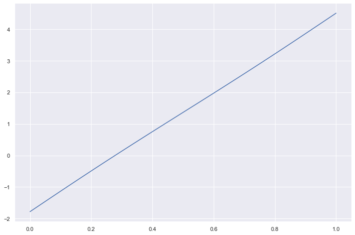
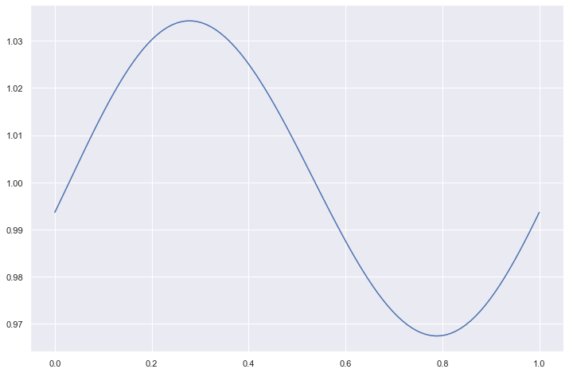
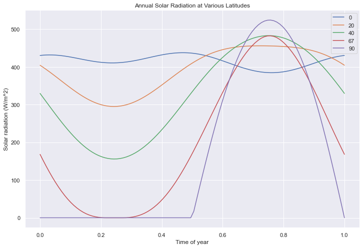
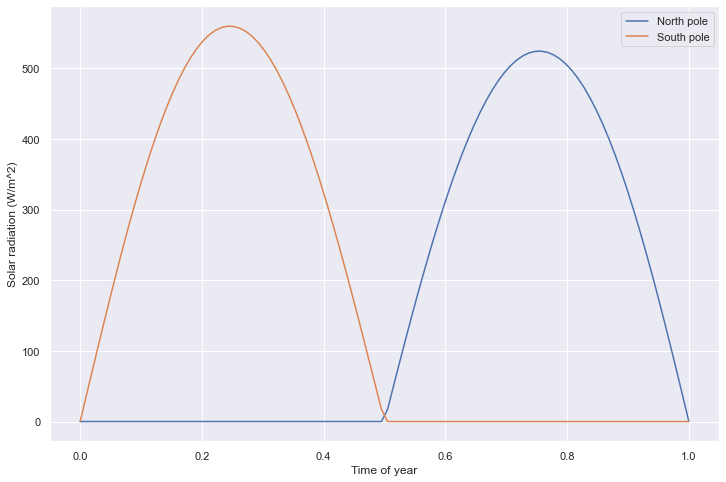
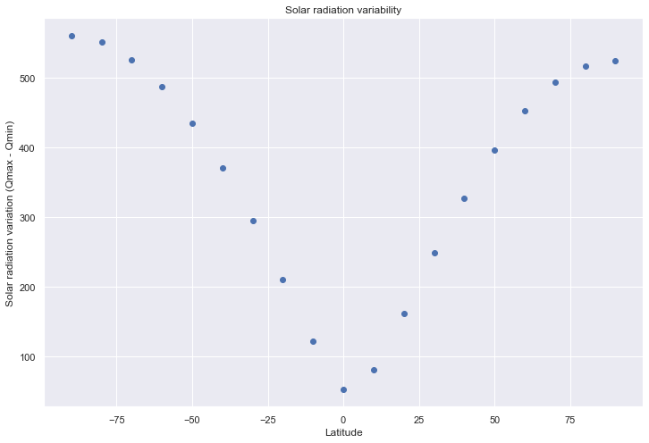
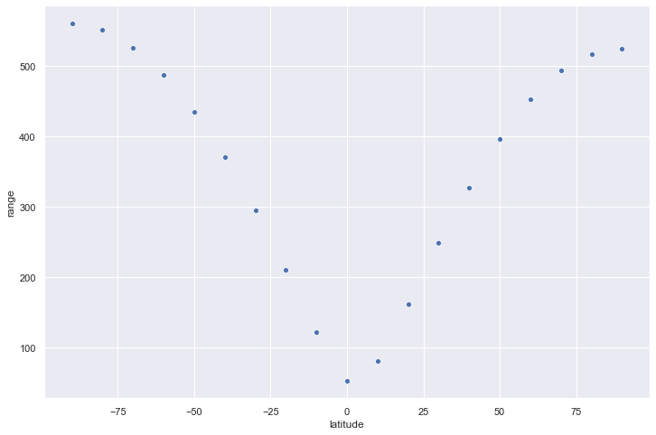

# Annual Solar Insolation

This notebook explores annual solar insolation. This is just like the other notebook, but uses python instead of Julia...

```python
# import all the libraries
import pandas as pd
import numpy as np
import matplotlib.pyplot as plt
import seaborn as sns

plt.rcParams['figure.figsize'] = (12.0, 8.0)  # default figure size
sns.set_context("notebook")
sns.set()
```

## Fundamental Equations

$Q$ is the total solar received at the top of the atmosphere (TOA), perpendiular to Earth's surface. It's defined as a function:

$$
Q(\varphi, \theta, t) = S_0(t) \left( \frac{\bar{R}}{R(\theta)}\right)^2 \cos z(\phi, \delta(t), h(t))
$$

```python
# Define constants
delta0 = np.deg2rad(23.45)  # Maximum declinatino of the Sun (Earth's tilt)
epsilon = 0.0167  # Eccentricity of Earth's orbit
theta0 = np.deg2rad(101.983)  # Longitude of perhelion
S0 = 1361  # Solar radiation constant, varies over million year timescales, but we are not concerned with that right now
T = 1  # Length of tropical year
```

```python
xi = lambda t: 2 * np.pi * t / T
def theta(t):
    angle = xi(t)
    return angle + 2 * epsilon * np.sin(angle) + 5 / 4 * epsilon ** 2 * np.sin(2 * angle) + epsilon ** 3 * ((13 * np.sin(3 * angle) - 3 * np.sin(angle)) / 12) - theta0
```

```python
timesteps = np.linspace(0, 1, 100)
thetas = np.array([theta(t) for t in timesteps])
plt.plot(timesteps, thetas)
plt.show()
```



```python
kepler = lambda t: ((1 + epsilon * np.cos(theta(t))) / (1 - epsilon**2))**2
```

```python
distances = np.array([kepler(t) for t in timesteps])
plt.plot(timesteps, distances)
plt.show()
```



```python
Sz = lambda delta, phi: np.sin(delta) * np.sin(phi)
Cz = lambda delta, phi: np.cos(delta) * np.cos(phi)

def hour_angle(delta, phi):
    s, c = Sz(delta, phi), Cz(delta, phi)
    if s + c <= 0:
        return 0
    elif abs(s) >= abs(c):
        return np.pi
    return np.arccos(-s/c)

def integrate_zenith(delta, phi):
    h = hour_angle(delta, phi)
    return (1 / np.pi) * (h * np.sin(phi) * np.sin(delta) + np.cos(phi) * np.cos(delta) * np.sin(h))

lat_of_declination = lambda t: -delta0 * np.sin(theta(t) + theta0)
```

```python
Q = lambda latitude, t: S0 * kepler(t) * integrate_zenith(lat_of_declination(t), np.deg2rad(latitude))

def temporal_q(latitude, steps=100):
    return np.array([Q(latitude, t) for t in np.linspace(0, 1, num=steps)])
```

```python
lats = [0, 20, 40, 67, 90]
steps = 100
timesteps = np.linspace(0, 1, num=steps)
for l in lats:
    qs = temporal_q(l, steps=steps)
    plt.plot(timesteps, qs, label=f"{l}")
plt.legend()
plt.xlabel("Time of year")
plt.ylabel("Solar radiation (W/m^2)")
plt.title("Annual Solar Radiation at Various Latitudes")
plt.show()
```



```python
north_pole = temporal_q(90)
south_pole = temporal_q(-90)
plt.plot(timesteps, north_pole, label="North pole")
plt.plot(timesteps, south_pole, label="South pole")
plt.legend()
plt.xlabel("Time of year")
plt.ylabel("Solar radiation (W/m^2)")
plt.show()
```



```python
north_50 = np.mean(temporal_q(50))
south_50 = np.mean(temporal_q(-50))
print(f"Average solar radiation at 50N: {north_50:.2f}")
print(f"Average solar radiation at 50S: {south_50:.2f}")
```

    Average solar radiation at 50N: 280.94
    Average solar radiation at 50S: 287.70

```python
latitudes = np.arange(-90, 100, step=10)
ranges = []
for l in latitudes:
    qs = temporal_q(l)
    ranges.append(np.max(qs) - np.min(qs))
plt.scatter(latitudes, ranges)
plt.xlabel("Latitude")
plt.ylabel("Solar radiation variation (Qmax - Qmin)")
plt.title("Solar radiation variability")
plt.show()
```



```python
df = pd.DataFrame({"latitude": latitudes, "range": ranges})
sns.scatterplot(data=df, x="latitude", y="range")
plt.show()
```



```python
from matplotlib.animation import FuncAnimation
from IPython.display import HTML
```

```python
lat = 67
steps = 100
timesteps = np.linspace(0, 1, num=steps)
qs_67 = temporal_q(lat, steps=steps)
qs_90 = temporal_q(90, steps=steps)
qs_30 = temporal_q(30, steps=steps)

fig, ax = plt.subplots()
ax.set_xlim([0, 1])
ax.set_ylim([0, 600])
labels_and_colors = [("30 degrees", 'g', qs_30), ("67 degrees", 'y', qs_67), ("90 degrees", 'b', qs_90)]
lines = [plt.plot([], [], label=l, color=c)[0] for (l, c, _) in labels_and_colors]

def update(frame):
    for (line, (_, _, qs)) in zip(lines, labels_and_colors):
        line.set_data(timesteps[:frame], qs[:frame])
    return lines

ani = FuncAnimation(fig, update, frames=steps + 30, interval=30, blit=True)
plt.xlabel("Time of year")
plt.ylabel("Solar radiation (W/m^2)")
plt.title("Annual Solar Radiation at Various Latitudes")
plt.legend()
HTML(ani.to_jshtml())
```
